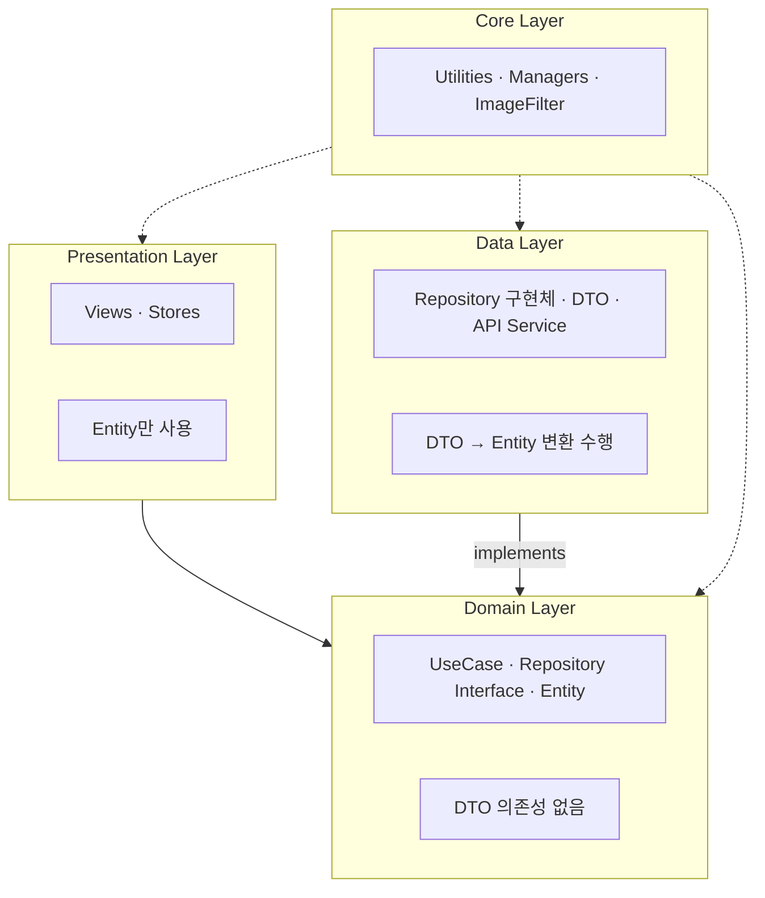
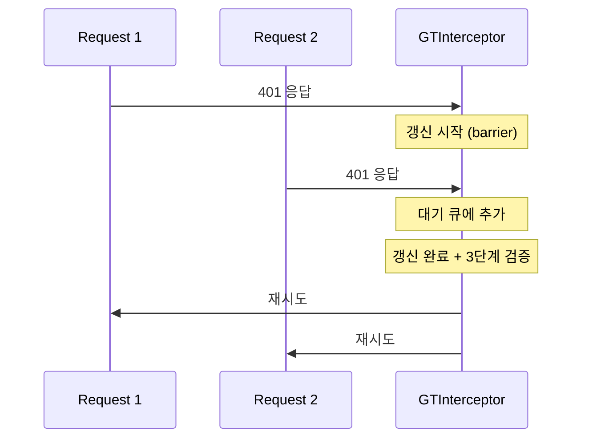
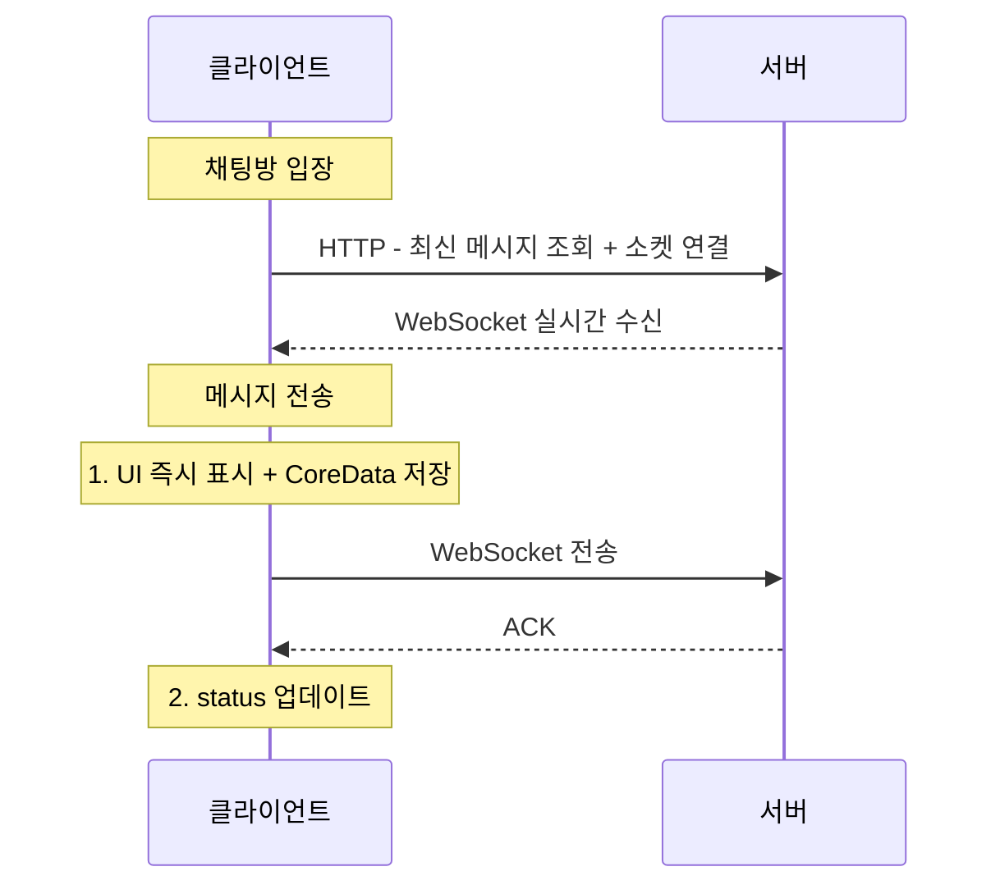

# GLINT iOS 17.0+

> 사용자가 직접 사진 필터를 제작·판매하고, 실시간 채팅과 커뮤니티로 창작과 소통이 이루어지는 소셜 기반 서비스 앱

<div align="center">
  
</div>


---

## 프로젝트 정보

| 항목 | 내용 |
|:---:|:---|
| **개발 기간** | 2025.05 - 2025.06 (4주) |
| **개발 인원** | 4인 (기획 1 · 디자인 1 · 서버 1 · iOS 1) |
| **최소 버전** | iOS 17.0+ |
| **기술 스택** | SwiftUI · UIKit · Core Image · Combine · @Observable |
| **아키텍처** | MVI + Clean Architecture |
| **네트워킹** | Alamofire · Socket.IO · Firebase FCM |
| **라이브러리** | Nuke · Firebase · KakaoSDK · iamport-ios |

---

## 주요 기능

| 기능 | 설명 |
|:---|:---|
| **이미지 편집** | 12종 CIFilter 실시간 적용, 전·후 비교, 50단계 Undo/Redo |
| **실시간 채팅** | WebSocket 메시지·이미지 송수신, 오프라인 메시지 복구, 검색 |
| **필터 마켓** | 커스텀 필터 제작·판매, 역지오코딩, PG 결제 |
| **소셜 로그인** | Apple/Kakao 연동, Keychain 보안 토큰, 자동 갱신 |
| **커뮤니티** | 게시글·댓글, 필터 추천, Push 알림 |

---

## 아키텍처



---

## 기술적 도전과 해결

### 1. 실시간 필터 성능 최적화 — 메모리 13배 절감

고해상도(3000×4000) 이미지에 12종 CIFilter를 연속 적용하면 메모리가 **1.32GiB**까지 치솟으며 크래시가 발생했습니다. Instruments VM Tracker로 분석한 결과, 필터마다 CIImage → UIImage 변환이 반복되면서 메모리가 누적되는 것이 원인이었습니다.

**해결 방향:**

- **프리뷰/원본 분리** — 화면 표시는 256px 축소 이미지로, 저장 시에만 원본 해상도 사용
- **CIContext 싱글톤** — GPU 리소스를 공유하여 매 필터마다 새로 할당하는 비용 제거
- **활성 필터만 적용** — 기본값과 동일한 필터는 체인에서 스킵

**Instruments 측정 결과:**

| 구분 | Persistent | Total Bytes |
|:---:|:---:|:---:|
| 최적화 이전 | 46.52 MiB | **1.32 GiB** |
| 최적화 이후 | 1.69 MiB | **102.94 MiB** |

> 메모리 13배 감소, 크래시 0건, 필터 슬라이더 조작 시 즉각 반영

---

### 2. 토큰 갱신 동시성 제어 — Race Condition 방지

Access Token 만료 시 여러 API 요청이 동시에 401을 받으면, 각각 독립적으로 토큰 갱신을 시도하면서 중복 갱신·토큰 불일치·Keychain 동시 쓰기 문제가 발생했습니다.

**해결 방향:**

- **DispatchQueue barrier 패턴** — Concurrent Queue에서 읽기는 병렬 허용, 쓰기(토큰 갱신 상태 변경)는 barrier로 직렬화
- **pendingRequests 큐** — 갱신 중 들어오는 요청을 대기열에 보관, 갱신 완료 후 일괄 재시도
- **3단계 토큰 검증** — 저장 즉시 읽기 → 값 일치 확인 → 0.1초 간격 3회 일관성 검증



> 10개 동시 401 응답에서 갱신 1회만 실행, Race Condition 완벽 방지

---

### 3. WebSocket + CoreData 오프라인 메시지 복구

HTTP 폴링 방식은 메시지 수신까지 최대 5초 지연되었고, 네트워크 끊김 시 전송 중인 메시지가 유실되었습니다.

**해결 방향:**

- **Optimistic UI** — 메시지 전송 시 UI에 즉시 표시하고 CoreData에 `sendStatus: 0`(대기)으로 저장. 서버 ACK 수신 후 `status: 1`로 업데이트
- **지수 백오프 재연결** — 연결 끊김 시 1s → 2s → 4s → ... 최대 30s 간격으로 자동 재연결
- **오프라인 동기화** — 온라인 복귀 시 `sendStatus == 0`인 메시지를 일괄 재전송



> 지연 5s → 100ms 이하(50배 개선), 오프라인 메시지 복구율 100%

---

### 4. Clean Architecture — Domain Layer DTO 의존성 제거

초기 설계에서 DTO가 Core Layer에 위치하여 Domain Layer가 DTO에 직접 의존하는 구조였습니다. 서버 API 응답이 변경될 때마다 Domain Layer까지 수정해야 했고, 이는 Clean Architecture 도입 목적에 부합하지 않았습니다.

**해결 방향:**

- **DTO를 Data Layer로 이동** — `Core/Models/` → `Data/DTO/`
- **Repository가 Entity만 반환** — Protocol 기반에서 Struct 기반으로 전환하여 witness table 오버헤드도 함께 제거
- **변환 로직을 Data Layer에 격리** — `SignInResponse+Entity.swift` 같은 Extension으로 DTO→Entity 변환

```
[Before]                              [After]
Core/Models/ ← Domain 의존             Data/DTO/ ← Data 내부에서만 사용
Domain → Core (DTO 알고 있음)           Domain → Entity만 사용 (DTO 모름)
UseCase에서 response.toEntity()        Data Layer에서 변환 후 Entity 반환
```

> Domain Layer DTO import 0개 달성, 114개 파일 리팩토링 (878줄 추가 / 284줄 삭제)

---

### 5. 네트워크 상태별 이미지 캐시 동적 관리

사진 필터 앱 특성상 반복적인 이미지 로딩이 빈번했고, 글로벌 환경에서 네트워크 상태에 따라 로딩 전략을 다르게 가져갈 필요가 있었습니다.

NWPathMonitor로 네트워크 상태를 감지하고, Nuke ImagePipeline의 캐시 정책을 동적으로 재구성하는 `NetworkAwareCacheManager`를 구현했습니다.

| 네트워크 | 메모리 캐시 | 디스크 캐시 | 다운샘플링 | 이미지 제한 |
|:---:|:---:|:---:|:---:|:---:|
| WiFi | 50MB | 200MB | 800×800 | 50개 |
| Cellular | 25MB | 100MB | 500×500 | 30개 |
| Offline | 15MB | 50MB | — | 20개 |

> 네트워크 변경 시 자동 전환, 오프라인에서도 캐시 기반 이미지 표시 보장

---

## 프로젝트 구조

```
Source/
├── Presentation/       # View + Store (MVI)
├── Domain/             # Entity · UseCase · Repository Interface
├── Data/               # DTO · Repository 구현체 · Network · CoreData
└── Core/               # Utilities · Manager · ImageFilter · Services
```

---

## 라이선스

이 프로젝트는 개인 포트폴리오 목적으로 제작되었습니다.
