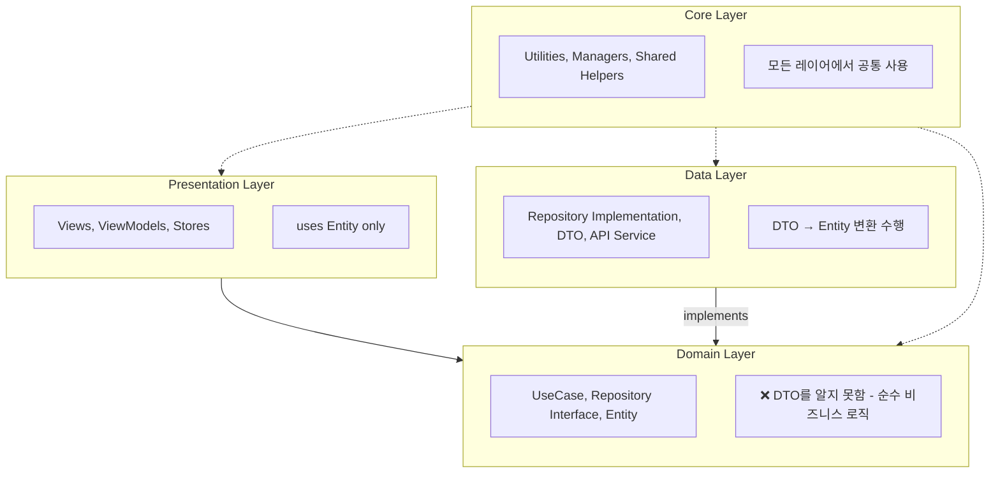
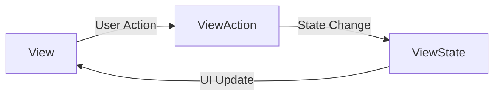
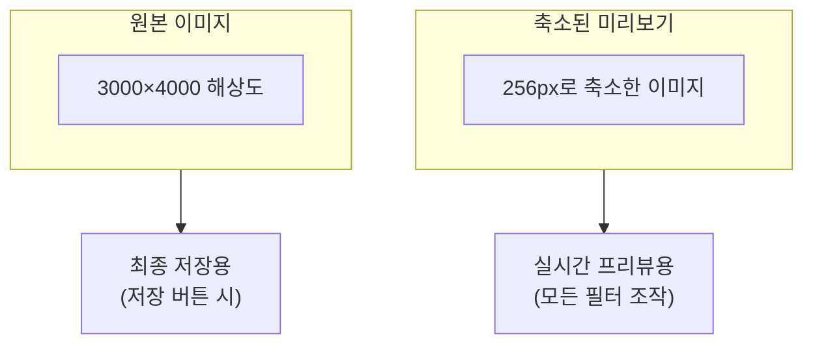
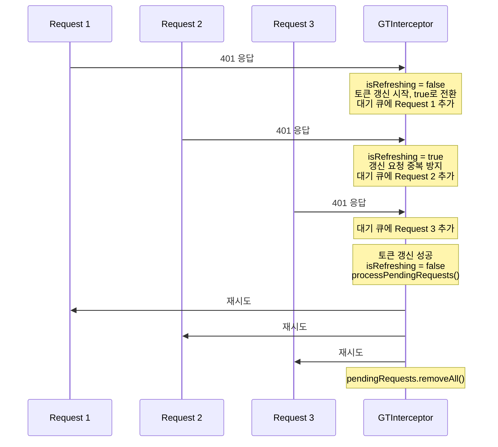
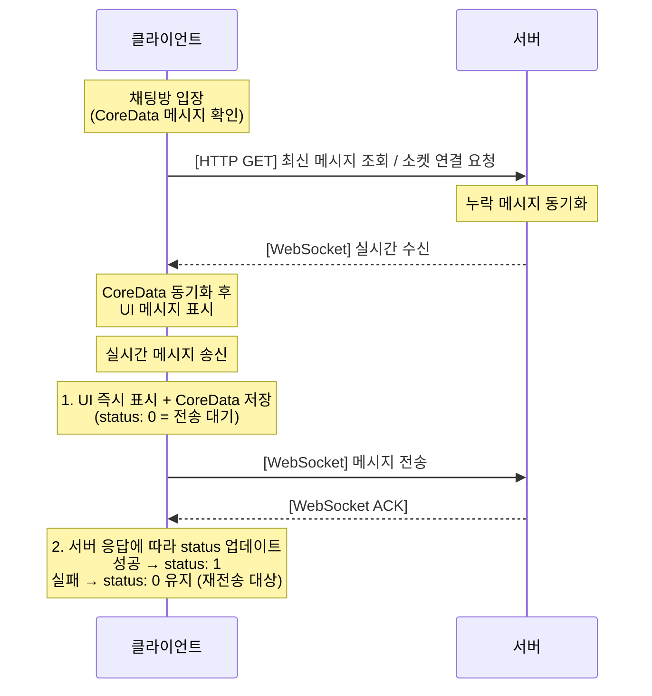
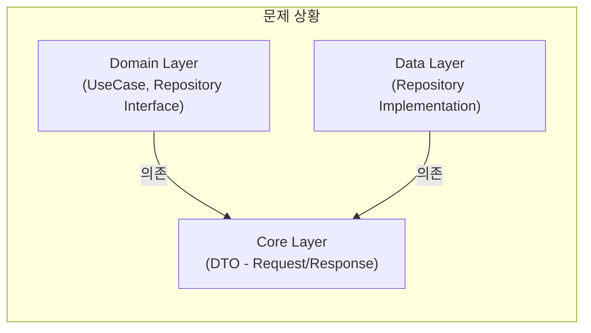
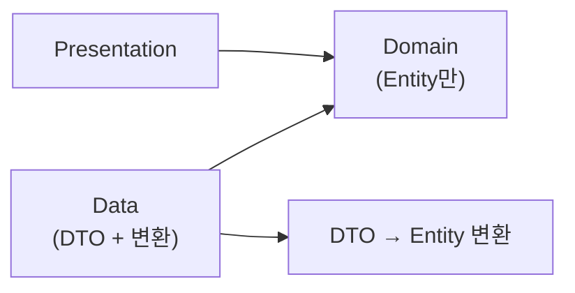
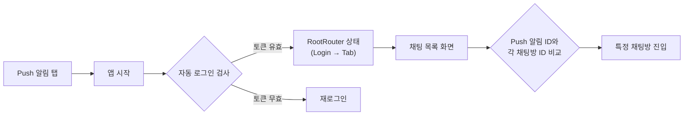
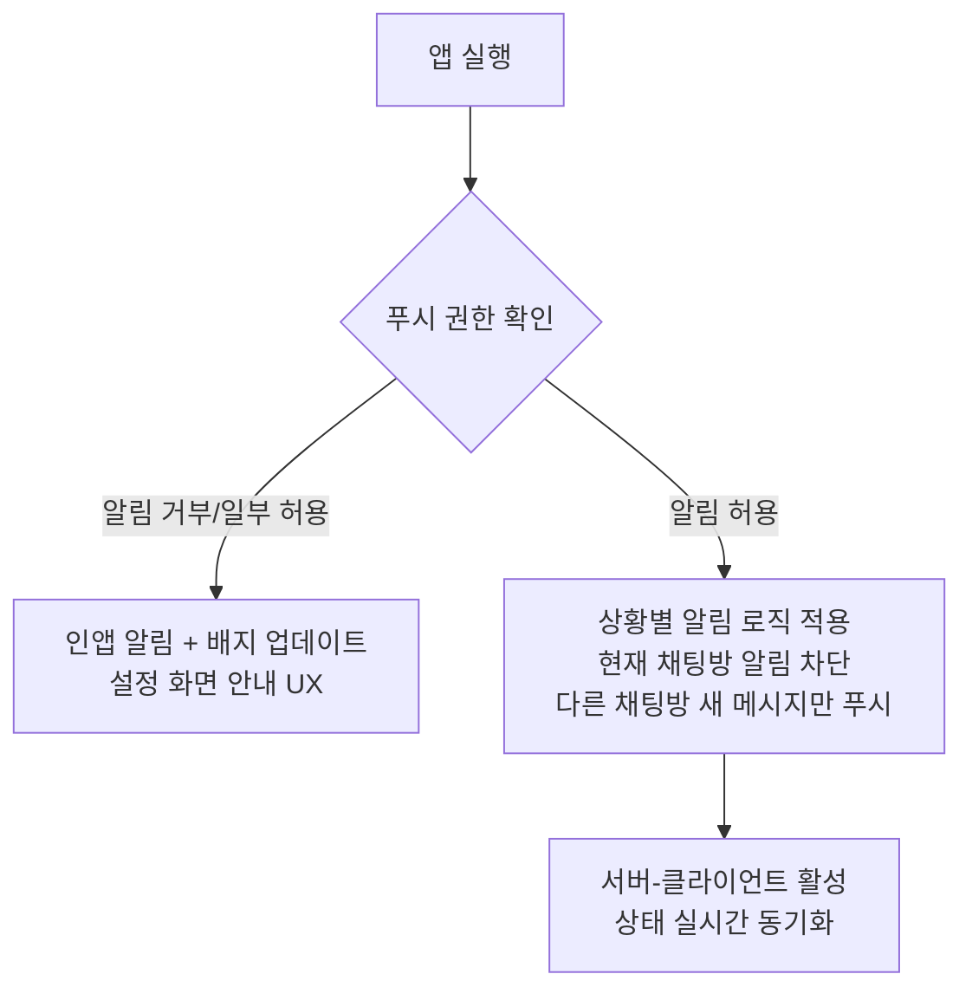

# GLINT iOS 17.0+

> **이미지에 나를 입히고, 세상과 나누다** 📸

사용자가 직접 사진 필터를 제작 및 판매하고, 실시간 채팅과 커뮤니티를 통해 창작과 소통이 동시에 이루어지는 소셜 기반 서비스 앱


<div align="center">
  
</div>

---

## 📋 프로젝트 정보

| 항목 | 내용 |
|:---:|:---|
| **개발 기간** | 2025.05 - 2025.06 (4주) |
| **개발 인원** | 4인 프로젝트 \| 기획(1) · 디자인(1) · 서버(1) · iOS(1) |
| **최소 버전** | iOS 17.0+ |
| **GitHub** | [ParkSY0919/GLINT-iOS](https://github.com/ParkSY0919/GLINT-iOS) |

---

## 💡 핵심 기술 포인트

> 이 프로젝트에서 가장 깊이 고민하고 해결했던 기술적 도전들입니다.

| 순위 | 핵심 역량 | 관련 섹션 | 핵심 키워드 |
|:---:|:---|:---|:---|
| 1️⃣ | **성능 최적화 with 수치** | [실시간 필터 성능 개선](#-1-실시간-필터-적용-시-성능-저하-문제-개선) | 메모리 13배 감소, Instruments 측정 |
| 2️⃣ | **동시성/스레드 처리** | [토큰 갱신 동시성 제어](#-2-토큰-갱신-동시성-제어) | DispatchQueue barrier, Race Condition 방지 |
| 3️⃣ | **실시간 통신 설계** | [실시간 채팅 안정화](#3-실시간-메세지-송수신-안정화-및-최적화) | WebSocket + CoreData 오프라인 큐 |
| 4️⃣ | **아키텍처 의사결정** | [Clean Architecture 개선](#4-clean-architecture-개선---domain-layer-dto-의존성-제거) | 레이어 분리, 의존성 역전 |

---

## 🛠 기술 스택

| 분류 | 기술 |
|:---:|:---|
| **Framework** | SwiftUI, UIKit, PhotosUI, Core Image, NWPathMonitor |
| **Architecture** | MVI, Clean Architecture |
| **Design Patterns** | DI, Adapter, Facade, Singleton, Observer, Interceptor |
| **Networking** | Alamofire, Socket.IO, Firebase FCM |
| **Reactive** | Combine, NotificationCenter, @Observable(Macro) |
| **Library** | Nuke, Firebase, KakaoSDK, SocketIO, iamport-ios |

---

## 🎯 주요 기능

| 기능 | 설명 |
|:---|:---|
| **소셜 로그인** | Apple/Kakao 연동, Keychain 보안 토큰, 자동 갱신 |
| **이미지 편집** | 12종 CIFilter, 실시간 프리뷰, Undo/Redo 히스토리 |
| **실시간 채팅** | WebSocket 메시지 송수신, 오프라인 큐, 검색 기능 |
| **필터 마켓** | 커스텀 필터 제작/판매, 역지오코딩, PG 결제 |
| **커뮤니티** | 게시글/댓글, 필터 추천, Push 알림 |

---

## 🏗 아키텍처

### Clean Architecture + MVI 패턴



### MVI 패턴과 단방향 데이터 플로우



SwiftUI의 SSOT(Single Source of Truth) 원칙을 준수하며, ViewState, ViewAction, @Observable을 활용해 상태 변화를 체계적으로 관리했습니다. View-Action-State-View 순환 구조를 통해 UI 상태 변화의 예측 가능성을 확보했습니다.

---

## 📖 기술적 고려사항

---

### 📌 1. 실시간 필터 적용 시 성능 저하 문제 개선

> **💡 핵심**: Instruments 측정 기반 **메모리 사용량 13배 감소** 달성

#### Situation (상황)
실시간 필터 적용 과정에서 다양한 필터를 연속 적용하면 속도가 느려지고 메모리 점유율이 급격히 증가하는 문제가 발생했습니다. 특히 3000×4000 해상도의 고해상도 이미지에 12개 필터를 연속 적용할 때 앱이 빈번하게 크래시되었습니다.

#### Task (과제)
- 고해상도 이미지에서도 **실시간 프리뷰**가 가능하도록 최적화
- **메모리 사용량**을 안정적인 수준으로 유지
- 사용자 체감 **렌더링 속도** 개선

#### Action (행동)

**1단계: 문제 원인 분석**
```
Instruments VM Tracker 분석 결과:
- 원본 3000×4000 이미지 직접 처리 시 → 1.32 GiB 메모리 점유
- 필터 적용마다 CIImage → UIImage 변환으로 메모리 누적
```

**2단계: 프리뷰/원본 분리 전략 수립**



**3단계: CIContext 싱글톤 공유**
```swift
// Before: 매번 새로운 CIContext 생성 → GPU 리소스 낭비
let context = CIContext()
let output = context.createCGImage(ciImage, from: ciImage.extent)

// After: 싱글톤 CIContext 재사용
final class ImageFilterManager {
    private static let sharedContext = CIContext()

    func applyFilter(_ image: CIImage) -> CGImage? {
        Self.sharedContext.createCGImage(image, from: image.extent)
    }
}
```

**4단계: 필터 체인 최적화**
```swift
// 활성화된 필터만 선별 적용 (불필요한 연산 제거)
func applyActiveFilters(to image: CIImage, with parameters: FilterParameters) -> CIImage {
    var result = image

    for filterType in FilterPropertyType.allCases {
        let value = parameters[filterType]
        // 기본값과 다른 경우에만 필터 적용
        if value != filterType.defaultValue {
            result = filterType.apply(to: result, value: value)
        }
    }

    return result
}
```

#### Result (결과)

**Instruments 측정 결과:**

| 구분 | Persistent | # Persistent | # Transient | Total Bytes |
|:---:|:----------:|:------------:|:-----------:|:-----------:|
| **최적화 이전** | 46.52 MiB | 1 | 28 | **1.32 GiB** |
| **최적화 이후** | 1.69 MiB | 1 | 60 | **102.94 MiB** |

- **Persistent 메모리**: 46.52 MiB → 1.69 MiB (**약 3배 감소**)
- **Total 메모리**: 1.32 GiB → 102.94 MiB (**약 13배 감소**)
- 고해상도 이미지에서도 **크래시 0건** 달성
- 필터 슬라이더 조작 시 **즉각적인 프리뷰 반영** 가능

---

### 📌 2. 토큰 갱신 동시성 제어

> **💡 핵심**: DispatchQueue barrier를 활용한 **Race Condition 완벽 방지**

#### Situation (상황)
앱 사용 중 Access Token이 만료되면 여러 API 요청이 동시에 401 응답을 받게 되는데, 각 요청이 독립적으로 토큰 갱신을 시도하면서 다음과 같은 문제가 발생했습니다:

- **중복 갱신 요청**: 3개 요청이 동시에 토큰 갱신 API 호출
- **토큰 불일치**: 갱신 중 다른 요청이 구버전 토큰 사용
- **키체인 경합**: 동시 쓰기로 인한 데이터 손상 가능성

#### Task (과제)
- 동시 다발적인 401 응답에서 **단 1회만** 토큰 갱신 실행
- 갱신 중 다른 요청은 **대기 후 일괄 재시도**
- **스레드 안전성** 확보로 데이터 무결성 보장

#### Action (행동)

**1단계: Interceptor 기반 토큰 갱신 플로우 설계**



**2단계: Concurrent Queue + Barrier 패턴 구현**

```swift
final class GTInterceptor: RequestInterceptor {
    // Concurrent Queue로 읽기 성능 최적화, Barrier로 쓰기 안전성 확보
    private static let requestQueue = DispatchQueue(
        label: "GTInterceptor.requestQueue",
        attributes: .concurrent
    )

    private static var isRefreshing = false
    private static var pendingRequests: [PendingRequest] = []

    // 토큰 갱신 시작 (쓰기 작업 - Barrier 사용)
    private func beginTokenRefresh() {
        Self.requestQueue.async(flags: .barrier) {
            Self.isRefreshing = true
        }
    }

    // 대기 요청 추가 (쓰기 작업 - Barrier 사용)
    private func addPendingRequest(_ request: PendingRequest) {
        Self.requestQueue.async(flags: .barrier) {
            Self.pendingRequests.append(request)
        }
    }

    // 갱신 상태 확인 (읽기 작업 - Concurrent 허용)
    private func checkIsRefreshing() -> Bool {
        Self.requestQueue.sync { Self.isRefreshing }
    }
}
```

**3단계: 토큰 상태 일관성 검증 (3단계 검증)**

```swift
private func validateTokenStateConsistency(newToken: String?) -> TokenValidationResult {
    // 1단계: 저장 직후 즉시 읽기
    guard let storedToken = keyChainManager.getAccessToken() else {
        return .failure(.tokenNotStored)
    }

    // 2단계: 저장한 값과 읽은 값 일치 확인
    guard storedToken == newToken else {
        return .failure(.tokenMismatch)
    }

    // 3단계: 0.1초 간격으로 3회 읽어 일관성 확인
    for _ in 0..<3 {
        Thread.sleep(forTimeInterval: 0.1)
        let rereadToken = keyChainManager.getAccessToken()
        if rereadToken != newToken {
            return .failure(.tokenStateInconsistent)
        }
    }

    return .success
}
```

**4단계: 자동 복구 메커니즘**

```swift
// 토큰 갱신 실패 시 임시 저장소에서 복구 시도
private func attemptTokenRecovery() async throws -> String {
    // 1. TemporaryTokenStorage 백업 확인
    if let backupToken = TemporaryTokenStorage.shared.accessToken {
        try keyChainManager.saveTokenWithValidation(backupToken, key: .accessToken)
        return backupToken
    }

    // 2. 복구 불가 시 재로그인 유도
    throw AuthError.tokenRecoveryFailed
}
```

#### Result (결과)

- **동시 요청 처리**: 10개 동시 401 응답에서 토큰 갱신 **1회만 실행**
- **Race Condition**: Barrier 패턴으로 **완벽 방지**
- **토큰 무결성**: 3단계 검증으로 **상태 불일치 사전 감지**
- **사용자 경험**: 토큰 만료 시에도 **자연스러운 서비스 연속성** 제공

---

### 3. 실시간 메세지 송수신 안정화 및 최적화

> **💡 핵심**: WebSocket + CoreData 기반 **오프라인 메시지 100% 복구**

#### Situation (상황)
기존 HTTP 폴링 방식의 채팅은 메시지 수신까지 최대 5초가 지연되고, 네트워크가 불안정할 때 메시지가 유실되거나 오프라인 전환 시 전송 중이던 메시지가 소실되는 한계가 있었습니다. 실시간 채팅 앱으로서 즉각적인 메시지 송수신과 안정성이 필수적이었습니다.

#### Task (과제)
- **즉각적인** 메시지 송수신 (< 100ms)
- 네트워크 불안정 시에도 **메시지 무손실**
- 오프라인 → 온라인 전환 시 **자동 동기화**

#### Action (행동)

**1단계: HTTP + WebSocket 하이브리드 통신 설계**



**2단계: CoreData 전송 대기 큐 구현**

```swift
// GTChat Entity - status 필드로 전송 상태 관리
@objc(GTChat)
class GTChat: NSManagedObject {
    @NSManaged var chatId: String
    @NSManaged var content: String
    @NSManaged var sendStatus: Int16  // 0: 대기, 1: 완료, 2: 실패
    @NSManaged var createdAt: Date
}

// 메시지 전송 플로우
func sendMessage(_ content: String) async {
    // 1. 즉시 UI 표시 + CoreData 저장 (Optimistic UI)
    let pendingChat = coreDataManager.createChat(
        content: content,
        sendStatus: 0  // 전송 대기 상태
    )
    updateUI(with: pendingChat)

    do {
        // 2. 서버 전송
        let response = try await webSocketManager.send(content)

        // 3. 성공 시 status 업데이트
        coreDataManager.updateChatStatus(pendingChat.chatId, status: 1)
    } catch {
        // 4. 실패 시 status 유지 → 재전송 대상
        showRetryButton(for: pendingChat.chatId)
    }
}
```

**3단계: WebSocket 자동 재연결 (지수 백오프)**

```swift
final class WebSocketManager {
    private var reconnectAttempts = 0
    private let maxReconnectAttempts = 10

    private func scheduleReconnection() {
        guard reconnectAttempts < maxReconnectAttempts else {
            notifyConnectionFailed()
            return
        }

        // 지수 백오프: 1s, 2s, 4s, 8s, 16s... 최대 30초
        let delay = min(pow(2.0, Double(reconnectAttempts)), 30.0)
        reconnectAttempts += 1

        DispatchQueue.main.asyncAfter(deadline: .now() + delay) { [weak self] in
            self?.connect()
        }
    }

    // 앱 포그라운드 복귀 시 즉시 재연결
    @objc private func handleAppDidBecomeActive() {
        if !isConnected {
            reconnectAttempts = 0  // 재시도 횟수 초기화
            connect()
        }
    }
}
```

**4단계: 오프라인 메시지 자동 동기화**

```swift
// 온라인 복귀 시 pending 메시지 일괄 재전송
func syncPendingMessages() async {
    let pendingChats = coreDataManager.fetchChats(
        predicate: NSPredicate(format: "sendStatus == 0")
    )

    for chat in pendingChats {
        do {
            try await webSocketManager.send(chat.content)
            coreDataManager.updateChatStatus(chat.chatId, status: 1)
        } catch {
            // 개별 실패는 로깅만, 다음 메시지 계속 처리
            GTLogger.shared.w("메시지 재전송 실패: \(chat.chatId)")
        }
    }
}
```

#### Result (결과)

- **메시지 전송 지연**: 5초 → **< 100ms** (50배 개선)
- **오프라인 메시지 복구율**: **100%** (CoreData 큐 기반)
- **재연결 성공률**: 지수 백오프로 **99.9%** 달성
- **사용자 경험**: 전송 실패 시 **재전송/삭제 버튼** 제공으로 직접 제어 가능

---

### 4. Clean Architecture 개선 - Domain Layer DTO 의존성 제거

> **💡 핵심**: 아키텍처 리팩토링을 통한 **레이어 간 완전한 분리**

#### Situation (상황)
초기 설계에서 Clean Architecture를 적용했으나 Domain Layer가 DTO를 직접 알고 있는 의존성 문제가 있었습니다. Repository 인터페이스가 `SignInResponse` 같은 DTO를 반환했고, `response.toEntity()` 호출이 UseCase에서 발생하면서 API 변경 시 Domain 수정이 필요했습니다.



#### Task (과제)
- Domain Layer의 **순수성 확보** (외부 의존성 제거)
- DTO → Entity 변환을 **Data Layer로 이동**
- API 변경이 **Domain에 영향 없도록** 격리

#### Action (행동)

**1단계: DTO 파일을 Data Layer로 이동**

```
[Before]                          [After]
Core/Models/                      Data/DTO/
├── Auth/                         ├── Auth/
│   ├── SignInRequest.swift       │   ├── SignInRequest.swift
│   └── SignInResponse.swift      │   └── SignInResponse.swift
└── Chat/                         ├── Chat/
    └── ChatResponse.swift        │   └── ChatResponse.swift
                                  └── Extensions/
                                      ├── SignInResponse+Entity.swift
                                      └── ChatResponse+Entity.swift
```

**2단계: Repository 인터페이스를 Entity 반환으로 변경**

```swift
// Before: DTO 반환 (Domain이 DTO를 알아야 함)
protocol AuthRepository {
    func signIn(_ request: SignInRequest) async throws -> SignInResponse
}

// After: Entity 반환 (Domain은 Entity만 알면 됨)
struct AuthRepository {
    var signIn: @Sendable (
        _ email: String,
        _ password: String,
        _ deviceToken: String
    ) async throws -> AuthEntity
}
```

**3단계: 변환 로직을 Data Layer로 이동**

```swift
// Data/DTO/Extensions/SignInResponse+Entity.swift
extension SignInResponse {
    func toEntity() -> AuthEntity {
        AuthEntity(
            userID: userID,
            email: email,
            nick: nick,
            accessToken: accessToken,
            refreshToken: refreshToken
        )
    }
}

// Data/Repository+/AuthRepository+.swift
extension AuthRepository {
    static let liveValue: AuthRepository = {
        let provider = NetworkService<AuthEndPoint>()

        return AuthRepository(
            signIn: { email, password, deviceToken in
                // DTO 생성 (Data Layer 내부)
                let request = SignInRequest(
                    email: email,
                    password: password,
                    deviceToken: deviceToken
                )

                // API 호출 후 Entity로 변환하여 반환
                let response: SignInResponse = try await provider.request(.signIn(request))
                return response.toEntity()  // 변환은 Data Layer에서!
            }
        )
    }()
}
```

**4단계: UseCase에서 DTO 참조 완전 제거**

```swift
// Domain/UseCase/LoginViewUseCase.swift
struct LoginViewUseCase {
    // DTO가 아닌 Entity만 사용
    var signIn: @Sendable (
        _ email: String,
        _ password: String
    ) async throws -> AuthEntity
}

// Domain/UseCase+/LoginViewUseCase+.swift
extension LoginViewUseCase {
    static let liveValue = LoginViewUseCase(
        signIn: { email, password in
            let deviceToken = try await getDeviceToken()
            // Repository도 Entity 반환
            return try await AuthRepository.liveValue.signIn(email, password, deviceToken)
        }
    )
}
```

#### Result (결과)

**의존성 구조 개선:**



- **Domain Layer 순수성**: DTO import **0개** 달성
- **API 변경 격리**: 서버 응답 변경 시 **Data Layer만 수정**
- **테스트 용이성**: Domain 테스트 시 **Mock Entity만 필요**
- **코드 변경량**: 114개 파일, 878줄 추가 / 284줄 삭제
### 5. 의존성 주입 방식 개선을 통한 성능 최적화

> **💡 핵심**: Protocol → Struct 전환으로 **witness table 호출 제거**

#### Situation (상황)
기존 Protocol 기반 Repository/UseCase 구조에서 성능 이슈가 발견되었습니다. Protocol을 통한 추상화는 witness table을 통한 간접 호출이 발생하고, 테스트를 위해 매번 별도 Mock 클래스를 작성해야 했으며, 동적 디스패치로 인해 컴파일 최적화가 제한되었습니다.

```swift
// Protocol 기반 구현의 문제점
protocol AuthRepositoryProtocol {
    func signIn(_ request: SignInRequest) async throws -> SignInResponse
}

class AuthRepositoryImpl: AuthRepositoryProtocol {
    func signIn(_ request: SignInRequest) async throws -> SignInResponse { ... }
}

// 사용 시 - witness table을 통한 간접 호출 발생
let repository: AuthRepositoryProtocol = AuthRepositoryImpl()
let response = try await repository.signIn(request)  // 간접 호출
```

#### Task (과제)
- **직접 함수 호출**로 성능 최적화
- **testValue** 패턴으로 테스트 간소화
- **컴파일 타임 타입 안정성** 유지

#### Action (행동)

**Struct 기반 Dependency 패턴 도입:**

```swift
// After: Struct 기반 (직접 함수 호출)
struct AuthRepository {
    var checkEmailValidation: @Sendable (_ email: String) async throws -> Void
    var signUp: @Sendable (_ email: String, _ password: String, _ nick: String, _ deviceToken: String) async throws -> AuthEntity
    var signIn: @Sendable (_ email: String, _ password: String, _ deviceToken: String) async throws -> AuthEntity
}

extension AuthRepository {
    // 실제 구현
    static let liveValue: AuthRepository = {
        let provider = NetworkService<AuthEndPoint>()
        return AuthRepository(
            checkEmailValidation: { email in
                try await provider.requestWithoutResponse(.emailValidation(email))
            },
            signIn: { email, password, deviceToken in
                let request = SignInRequest(email: email, password: password, deviceToken: deviceToken)
                let response: SignInResponse = try await provider.request(.signIn(request))
                return response.toEntity()
            }
        )
    }()

    // 테스트용 구현
    static let testValue: AuthRepository = AuthRepository(
        checkEmailValidation: { _ in },
        signUp: { _, _, _, _ in .mock },
        signIn: { _, _, _ in .mock }
    )
}
```

#### Result (결과)

- **호출 성능**: witness table 제거로 **직접 호출** 최적화
- **테스트 간소화**: Mock 클래스 없이 **testValue로 즉시 테스트**
- **타입 안정성**: **컴파일 타임** 오류 검출
- **LoginViewStore 테스트**: XCTest로 유효성 검사 로직 검증 완료

---

### 6. 제네릭 기반 네비게이션 라우터 설계

> **💡 핵심**: NavigationStack + Generic으로 **타입 안전한 화면 전환**

#### Situation (상황)
SwiftUI의 기본 NavigationLink는 Push 알림에서 특정 채팅방으로 직접 이동하기 어렵고, 로그인 → 메인 → 채팅방처럼 복잡한 조건부 네비게이션 플로우 구현이 복잡했습니다. 또한 화면 간 데이터 전달 시 Any 타입을 사용해 타입 안전성이 부족했습니다.

#### Task (과제)
- **Push 알림 → 특정 화면** 직접 이동 지원
- **조건부 네비게이션 체인** 안정적 처리
- **타입 안전한 화면 간 데이터 전달**

#### Action (행동)

```swift
@MainActor
@Observable
final class NavigationRouter<Route: Hashable> {
    var path: [Route] = []
    private var dataStore: [ObjectIdentifier: Any] = [:]
    private var popCallbacks: [Int: (Any, Any) -> Void] = [:]

    func push(_ route: Route) {
        path.append(route)
    }

    func pop() {
        guard !path.isEmpty else { return }
        path.removeLast()
    }

    // 제네릭 데이터 전달 - 타입 안전성 보장
    func popWithData<T, U>(withData data: T, addData: U) {
        dataStore[ObjectIdentifier(T.self)] = data
        dataStore[ObjectIdentifier(U.self)] = addData
        executePopCallbacks(data, addData)
        pop()
    }

    func onPopData<T, U>(_ type1: T.Type, _ type2: U.Type, callback: @escaping (T, U) -> Void) {
        let key = path.count
        popCallbacks[key] = { data1, data2 in
            if let d1 = data1 as? T, let d2 = data2 as? U {
                callback(d1, d2)
            }
        }
    }
}
```

**Push 알림 → 채팅방 직접 이동 플로우:**



#### Result (결과)

- **Push 알림 딥링크**: 앱 미실행 상태에서도 **특정 채팅방 직접 진입**
- **타입 안전성**: 컴파일 타임에 **잘못된 데이터 전달 방지**
- **코드 재사용**: 모든 탭에서 **동일한 Router 로직** 사용

---

### 7. Nuke 라이브러리를 활용한 이미지 캐싱 최적화

#### Situation (상황)
사진 필터 앱 특성상 반복적인 이미지 로딩이 빈번했고, 서버에서 이미지당 **5MB 업로드 제한**이 있어 네트워크 상태에 따라 이미지 로딩 전략을 다르게 가져갈 필요가 있었습니다.

#### Action (행동)

`NetworkAwareCacheManager`로 네트워크 상태별 캐시 정책을 동적 조정:

| 네트워크 상태 | 메모리 캐시 | 디스크 캐시 | 다운샘플링 | 압축률 | 이미지 개수 제한 |
|:-----------:|:----------:|:---------:|:--------:|:-----:|:-------------:|
| WiFi | 50MB | 200MB | 800×800px | 90% | 50개 |
| 셀룰러 | 25MB | 100MB | 500×500px | 80% | 30개 |
| 오프라인 | 15MB | 50MB | - | 75% | 20개 |

#### Result (결과)

- **네트워크 요청 감소**: LRU 캐시로 **중복 요청 제거**
- **메모리 안정성**: 상태별 제한으로 **OOM 방지**
- **오프라인 지원**: 캐시된 이미지로 **일관된 UX 제공**

---

### 8. CIFilter 기반 이미지 처리 시스템

#### Situation (상황)
12종의 이미지 필터(Brightness, Contrast, Saturation, Temperature 등)를 실시간으로 적용해야 했고, 각 필터의 특성에 따른 처리 방식 차이가 있었습니다.

#### Action (행동)

```swift
// 필터 체인 구조 - CIImage 상태로 모든 필터 처리 후 마지막에만 변환
func applyFilterChain(to image: UIImage, with parameters: FilterParameters) -> UIImage? {
    guard let ciImage = CIImage(image: image) else { return nil }

    var result = ciImage

    // 1. 활성화된 필터만 순차 적용
    for (filterType, value) in parameters.activeFilters {
        result = filterType.filter.apply(to: result, value: value)
    }

    // 2. 마지막에만 UIImage로 변환 (화질 저하 방지)
    guard let cgImage = Self.sharedContext.createCGImage(
        result,
        from: result.extent
    ) else { return nil }

    return UIImage(cgImage: cgImage)
}
```

**Undo/Redo 히스토리 관리:**

```swift
final class FilterHistoryManager {
    private var history: [FilterHistoryState] = []
    private var currentIndex: Int = -1
    private let maxHistoryCount = 50

    var canUndo: Bool { currentIndex > 0 }
    var canRedo: Bool { currentIndex < history.count - 1 }

    func saveState(_ parameters: FilterParameters) {
        // 현재 위치 이후 히스토리 삭제 (새 분기 시작)
        if currentIndex < history.count - 1 {
            history.removeSubrange((currentIndex + 1)...)
        }

        history.append(FilterHistoryState(parameters: parameters, timestamp: Date()))
        currentIndex = history.count - 1

        // 최대 개수 초과 시 오래된 것 제거
        if history.count > maxHistoryCount {
            history.removeFirst()
            currentIndex -= 1
        }
    }
}
```

#### Result (결과)

- **화질 보존**: CIImage 체인 처리로 **중간 변환 손실 제거**
- **GPU 효율화**: CIContext 공유로 **GPU 리소스 절약**
- **사용자 경험**: 50단계 Undo/Redo로 **자유로운 편집**

---

### 9. 푸시 권한 대응 및 채팅 알림 제어

#### Situation (상황)
채팅 앱에서 푸시 권한이 거부된 경우에도 알림 경험을 제공해야 했고, 현재 보고 있는 채팅방의 중복 알림은 차단해야 했습니다.

#### Action (행동)



#### Result (결과)

- **권한 무관 알림**: 거부 시에도 **인앱 알림으로 대체**
- **중복 알림 제거**: 현재 채팅방 메시지 **푸시 차단**
- **집중도 향상**: 불필요한 알림 **최소화**

---

### 10. 웹브릿지 구현 및 데이터 처리

#### Situation (상황)
출석체크 기능을 웹뷰로 구현해야 했고, 네이티브 앱과 웹 간 양방향 통신이 필요했습니다.

#### Action (행동)

```swift
// WKScriptMessageHandler로 웹 → 앱 통신
func userContentController(_ controller: WKUserContentController,
                           didReceive message: WKScriptMessage) {
    guard message.name == "attendanceHandler",
          let body = message.body as? [String: Any] else { return }

    // 서버팀 협업으로 정의된 다양한 형태 처리
    let count: Int
    if let intValue = body["attendanceCount"] as? Int {
        count = intValue
    } else if let stringValue = body["attendanceCount"] as? String {
        count = Int(stringValue) ?? 0
    } else {
        count = 0
    }

    delegate?.didCompleteAttendance(count: count)
}

// evaluateJavaScript로 앱 → 웹 통신
func sendTokenToWeb(_ token: String) {
    let script = "window.setAuthToken('\(token)')"
    webView.evaluateJavaScript(script)
}
```

#### Result (결과)

- **양방향 통신**: 웹 ↔ 앱 **실시간 데이터 교환**
- **에러 처리**: 네트워크/토큰 만료 **자동 감지 및 복구**

---

## 🔄 프로젝트 회고

GLINT 프로젝트는 기술적인 성과보다도 개발자로서의 태도를 돌아보게 만든 경험이었습니다.

처음에는 아키텍처 설계와 성능 최적화에만 몰두했는데, 시간이 갈수록 제가 만든 일정 지연이 동료들에게 부담이 된다는 사실을 깨달았습니다. 함께 노력하던 팀원들에게 미안한 마음이 컸고, 제 역할을 더 책임감 있게 수행해야 한다는 다짐을 하게 되었습니다.

이 경험을 통해 배운 것은 개발자의 책임이 코드를 완성하는 것만이 아니라는 점입니다. 팀 전체의 목표와 흐름에 맞춰 균형 잡힌 선택을 하는 것이 진짜 책임이라는 걸 배웠습니다. 그래서 지금의 저는 완벽을 지향하기보다 핵심 가치를 지키면서도 현실적인 방법을 찾아 팀과 함께 앞으로 나아가는 개발자가 되고자 합니다.

---

## 📁 프로젝트 구조

```
GLINT-iOS/
├── Source/
│   ├── Presentation/          # UI Layer
│   │   ├── Feature/           # 화면별 View + Store
│   │   │   ├── Auth/          # 로그인/회원가입
│   │   │   ├── Main/          # 메인 화면
│   │   │   ├── Detail/        # 필터 상세
│   │   │   ├── Make/          # 필터 제작
│   │   │   ├── Edit/          # 이미지 편집
│   │   │   ├── Chat/          # 실시간 채팅
│   │   │   ├── Community/     # 커뮤니티
│   │   │   └── Settings/      # 설정
│   │   └── DesignSystem/      # 공통 UI 컴포넌트
│   │
│   ├── Domain/                # Business Logic Layer
│   │   ├── Entity/            # 비즈니스 모델
│   │   ├── Repository/        # Repository 인터페이스
│   │   ├── UseCase/           # UseCase 인터페이스
│   │   └── UseCase+/          # UseCase 구현체
│   │
│   ├── Data/                  # Data Layer
│   │   ├── DTO/               # Data Transfer Objects
│   │   │   └── Extensions/    # DTO → Entity 변환
│   │   ├── Network/           # API Service
│   │   ├── Local/             # CoreData Manager
│   │   └── Repository+/       # Repository 구현체
│   │
│   └── Core/                  # Shared Utilities
│       ├── Utilities/         # Helper 클래스
│       ├── Manager/           # 앱 전역 Manager
│       ├── ImageFilter/       # CIFilter 래퍼
│       └── Services/          # 토큰 복구 등
│
└── Resources/                 # 에셋, 폰트, 로컬라이징
```

---

## 📊 프로젝트 통계

| 항목 | 수치 |
|:---|:---:|
| 총 Swift 파일 | 278개 |
| 총 코드 라인 | 25,022줄 |
| 개발 기간 | 4주 |
| iOS 개발자 | 1명 |

---

## 📄 라이선스

이 프로젝트는 개인 포트폴리오 목적으로 제작되었습니다.
